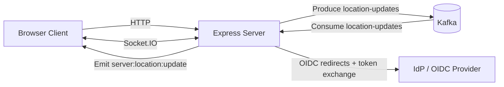
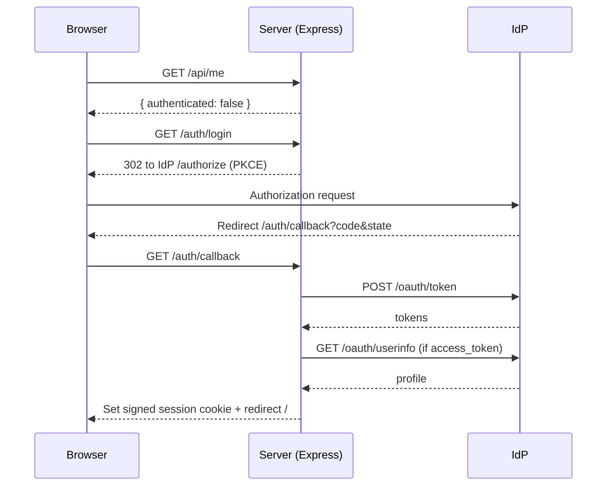
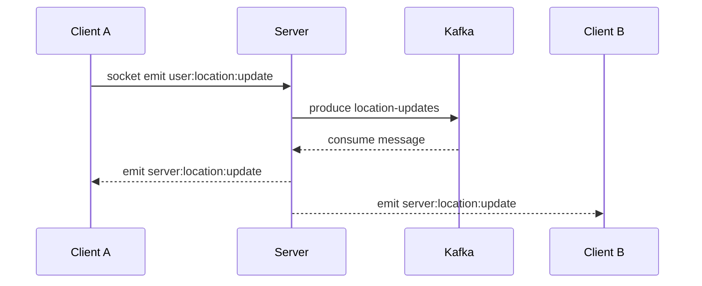

# Location Tracker

Real-time location sharing app built with Node.js, Express, Socket.IO, and Kafka.
Users authenticate through an OIDC-compatible Identity Provider (IdP), grant browser geolocation access, and then publish live coordinates that are streamed to all connected clients on a shared Leaflet map.

## Tech Stack

- **Backend:** Node.js (ESM), Express 5
- **Realtime transport:** Socket.IO
- **Event streaming:** Kafka (`kafkajs`)
- **Frontend:** Vanilla HTML/CSS/JS + Leaflet + OpenStreetMap tiles
- **Auth:** OIDC Authorization Code + PKCE (custom integration)
- **Infra (local):** Docker Compose (Kafka broker)

## File Structure

```text
location-tracker/
├── index.js              # Main server, auth flow, session handling, socket + Kafka bridge
├── kafka-client.js       # Shared Kafka client config
├── kafka-admin.js        # One-time topic creation script
├── data-processor.js     # Example consumer (simulates DB insert logs)
├── public/
│   └── index.html        # Map UI, auth shell, geolocation + socket client
├── docker-compose.yml    # Local Kafka service
├── .env.example          # Example environment variables
└── package.json
```

## Getting Started

### 1) Prerequisites

- Node.js 18+ (Node 20+ recommended)
- pnpm
- Docker Desktop (or Docker Engine)

### 2) Install dependencies

```bash
pnpm install
```

### 3) Configure environment

Create `.env` from `.env.example` and set values:

```bash
cp .env.example .env
```

Recommended local values:

```env
PORT=3000
PUBLIC_BASE_URL=url-after-tunneling/or-localhost
SESSION_SECRET=replace-with-a-long-random-string

OIDC_ISSUER_URL=https://auth.saumyagrawal.in
OIDC_CLIENT_ID=client-id

# Optional: pin the redirect URI instead of deriving it from PUBLIC_BASE_URL
OIDC_REDIRECT_URI=url-after-tunneling(or-localhost)/auth/callback

```

### 4) Start Kafka

```bash
docker compose up -d
```

### 5) Create Kafka topic

```bash
node kafka-admin.js
```

### 6) Start the app

```bash
pnpm start
```

Open: [http://localhost:3000](http://localhost:3000)

### Optional: run example background consumer

```bash
node data-processor.js
```

This prints consumed location events as simulated database inserts.


## How It Works

### High-level flow

1. Browser loads map UI (`public/index.html`).
2. UI calls `/api/me` to check whether a signed session exists.
3. If unauthenticated, user is shown login/register links (`/auth/login`, `/auth/register`).
4. Server builds OIDC authorization URL with PKCE and redirects to IdP.
5. IdP redirects back to `/auth/callback` with `code` + `state`.
6. Server exchanges code for tokens, fetches/derives user profile, creates signed cookie session.
7. Authenticated client connects Socket.IO and starts sending geolocation updates.
8. Server publishes updates to Kafka topic `location-updates`.
9. Server consumer reads from Kafka and emits `server:location:update` to all clients.
10. UI updates local and remote markers on Leaflet map.

### Architecture diagram



### Auth sequence (OIDC + session)



### Realtime location sequence



## Routes

### Page / static

- `GET /`  
  Serves `public/index.html` via `express.static`.

### Health

- `GET /health`  
  Returns service status.

Example response:

```json
{ "status": "ok" }
```

### Session/auth state

- `GET /api/me`  
  Returns whether user is authenticated, current user (if any), and OIDC config hints for frontend.

### Authentication

- `GET /auth/login`  
  Starts OIDC login flow.

- `GET /auth/register`  
  Starts OIDC signup flow (using configured signup endpoint).

- `GET /auth/callback`  
  Handles IdP redirect, exchanges authorization code for tokens, resolves user profile, creates session cookie, redirects back.

- `POST /auth/logout`  
  Clears session and cookie, redirects to `/`.

## Socket Events

### Client -> Server

- `user:location:update`  
  Payload:
  - `latitude` (number)
  - `longitude` (number)

### Server -> Client

- `server:location:update`  
  Payload includes:
  - `id` (socket id)
  - `latitude` (number)
  - `longitude` (number)
  - `user` (basic user profile)

- `server:auth:required`  
  Emitted when an unauthenticated socket tries to share location.

- `server:error`  
  Emitted when Kafka/realtime layer is unavailable.


## Future Improvements

- Persist sessions in Redis/DB (currently in-memory `Map`)
- Add JWT/id_token signature validation against IdP JWKs
- Add robust input validation/rate limiting on socket events
- Persist locations to a real database consumer
- Add automated tests and CI

